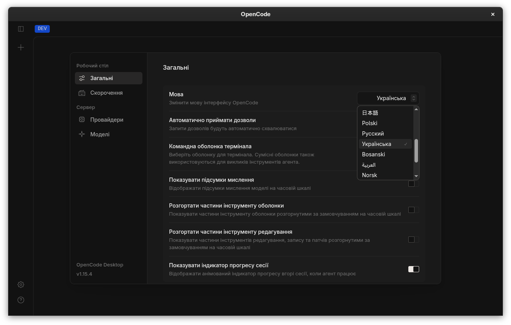

<p align="center">
  
</p>

<p align="center">The AI-powered coding agent. Fast. Unlimited. Made my own.</p>

---

> **icode** is a fork of [OpenCode](https://opencode.ai) — the open source AI coding
> agent — customized and maintained by **Valentin Irabizi Paisible**
> (`irabizipaisiblevalentin`). It is not affiliated with the OpenCode team.

## What is icode?

icode is an open-source AI coding agent that runs in your **terminal**. It plans,
writes, and runs code for you within your repository, and it's built to be fast.

- **Free & secure** — try iCode for free for 3 weeks; afterwards you need a
  Passcode (1,000 RWF one-time payment) to keep access.
- **English-first** — the interface and prompts are in English.
- **Two built-in agents**, switchable with `Tab`:
  - `build` — default, full-access agent for development work
  - `plan` — read-only agent for analysis and code exploration
- A `general` subagent for complex searches and multistep tasks (invoke with `@general`).

## Installation

```bash
# Build from source (requires Bun)
bun install
bun run --cwd packages/opencode build -- --single
```

The config file is `icode.json` / `icode.jsonc` (project level) and `~/.config/icode/`
(global). Replace `opencode` with `icode` in any migration guides — behavior and
config options stay compatible.

## Quick start

```bash
# Run interactively in the current directory
icode

# One-shot prompt, non-interactive
icode run "explain this codebase"

# List configured models and providers
icode models

# Show all commands and flags
icode --help
```

## Documentation

See [opencode's docs](https://opencode.ai/docs) — everything applies to icode.

## License

MIT, inherited from OpenCode. See [LICENSE](./LICENSE).

## Credits

This project builds on **OpenCode** ([anomalyco/opencode](https://github.com/anomalyco/opencode)),
which is distributed under the MIT license. Thank you to the OpenCode team and
community for the excellent foundation.